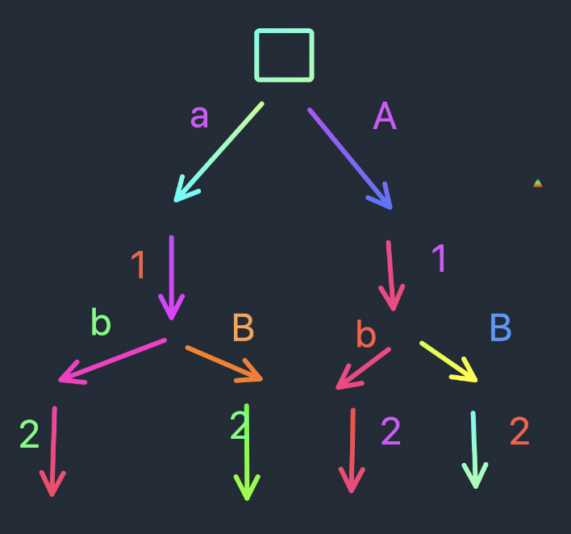

# 784.字母大小写全排列

### LeetCode 题目链接

[784.字母大小写全排列](https://leetcode.cn/problems/letter-case-permutation/)

### 解题

如何穷举呢？对于每一个字符，有如下选择：
- 如果该字符是字母，则可以是大写也可以是小写
- 如果该字符是数字，则只能是它本身



```js
var letterCasePermutation = function(s) {
    let track = "";
    let res = [];
    const backtrack = function(s, index) {
        if(index == s.length) {
            res.push(track);
            return;
        }
        if("0" <= s[index] && s.charAt(index) <= "9") {
            // s[index] 是数字
            track += s[index];
            backtrack(s, index + 1);
            track = track.slice(0, -1);
        } else {
            // s[index] 是字母
            // 小写字母，做选择
            track += s[index].toLowerCase();
            backtrack(s, index + 1);
            // 撤销选择
            track = track.slice(0, -1);

            // 大写字母，做选择
            track += s[index].toUpperCase();
            backtrack(s, index + 1);
            // 撤销选择
            track = track.slice(0, -1);
        }
    };
    backtrack(s, 0);
    return res;
};
```
```python
class Solution:
    def letterCasePermutation(self, s: str) -> List[str]:
        self.track = []
        self.res = []
        self.backtrack(s, 0)
        return self.res
    
    def backtrack(self, s, index):
        if index == len(s):
            self.res.append("".join(self.track))
            return
        
        if "0" <= s[index] <= "9":
            # s[index] 是数字
            self.track.append(s[index])
            self.backtrack(s, index + 1)
            self.track.pop()
        else:
            # s[index] 是字母
            # 小写字母，做选择
            self.track.append(s[index].lower())
            self.backtrack(s, index + 1)
            self.track.pop()
            
            # 大写字母，做选择
            self.track.append(s[index].upper())
            self.backtrack(s, index + 1)
            # 撤销选择
            self.track.pop()

# 写法 2
class Solution:
    def dfs(self, s, path, i, ans):
        if i == len(s):
            ans.append(path)
            return
        

        # 不改变当前字符的大小写，继续递归
        self.dfs(s, path + s[i], i + 1, ans)
        # 如果当前字符是字母，可以转换大小写进行递归
        if ord('a') <= ord(s[i]) <= ord('z'):
            self.dfs(s, path + s[i].upper(), i + 1, ans)
        elif ord('A') <= ord(s[i]) <= ord('Z'):
            self.dfs(s, path + s[i].lower(), i + 1, ans)

    def letterCasePermutation(self, s: str) -> List[str]:
        ans, path = [], ""
        self.dfs(s, path, 0, ans)
        return ans
```
- 时间复杂度：`O(n * 2^n)`，`n` 为字符串的长度
  - 如果是字母，有两种选择（大写和小写），如果是数字，只有一种选择
  - 其中有 k 个字母，最坏情况下（所有字符都是字母），算法会生成 `2^n` 种排列
  - 每次生成一个排列时，需要 O(n) 的时间来构建字符串（"".join(self.track)）
- 空间复杂度：`O(n * 2^n)`
  - 递归调用栈的深度为字符串的长度 n，占用 O(n) 的空间
  - self.track 列表在任何时候最多包含 n 个字符，占用 O(n) 的空间
  - 最终结果 self.res 包含所有可能的排列。在最坏情况下（所有字符都是字母），会有 2^n 个排列，每个长度为 n。因此，self.res 占用 O(n * 2^n) 的空间

**优化版本**

使用位运算，使得空间复杂度降到 `O(n * 2^n)`，但省略了递归调用栈的空间

```python
class Solution:
    def letterCasePermutation(self, s: str) -> List[str]:
        # 找出字符串中所有字母的索引，存储在 letters 列表中
        letters = [i for i, char in enumerate(s) if char.isalpha()]
        n = len(letters)
        res = []
        
        # 1 << n 等价于 2^n，表示所有可能的组合数
        # 对于每个数字 i（从 0 到 2^n - 1），用它的二进制表示来决定每个字母是大写还是小写
        for i in range(1 << n):  # 2^n
            # 将字符串 s 转换为列表 word，因为字符串在 Python 中是不可变的，列表方便替换元素
            word = list(s)
            for j in range(n):
                # 使用位运算来判断 i 的第 j 位是否为 1
                # 1 << j 表示 1 左移 j 位，即 2^j（第 j 位为 1）
                if i & (1 << j):
                    # 如果 i 的第 j 位为 1，则将 letters[j] 对应的字母转换为大写
                    word[letters[j]] = word[letters[j]].upper()
                else:
                    word[letters[j]] = word[letters[j]].lower()
            res.append(''.join(word))
        
        return res
```